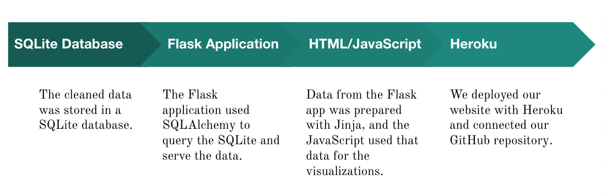

# Project-2
Team members: Tori Arriola, Yifei Cao, Kylee Grant, Leah Handel, Catie Lutz, Rana Saber

# Project Requirements
1. Your visualization must include a Python Flask–powered API, HTML/CSS, JavaScript, and a database (SQL, MongoDB, SQLite).
2. Your project should fall into one of the below four tracks:
     
     - A custom “creative” D3.js project (i.e., a nonstandard graph or chart)
     - A combination of web scraping and Leaflet or Plotly
     - A dashboard page with multiple charts that update from the same data
     - A “thick” server that performs multiple manipulations on data in a database prior to visualization (must be approved)
     
3. Your project should include at least one JS library that we did not cover.
4. Your project must be powered by a data set with at least 100 records.
5. Your project must include some level of user-driven interaction (e.g., menus, dropdowns, textboxes).
6. Your final visualization should ideally include at least three views.

# Inspiration and Guiding Questions
Our team was inspired to understand to a greater extent the occurance of teen pregnancy across the United States. After reviewing our data, we had two guiding questions: 
1. What is the current trend of teen births in the U.S.? 
2. What correlations exist between the rate of teen births and other factors, such as age and location? 

For more information on the importance of this topic, please refer to [this article](https://www.cdc.gov/teenpregnancy/about/index.htm) by the CDC. 

# Dataset Overview
We utilized two datasets from the National Center for Health Statistics, which is part of the Centers for Disease Control and Prevention. In addition, we utilized the JSON version of the U.S. and State Trends on Teen Births dataset in addition to GeoJSON boundaries for the states.

## [Teen Birth Rates for Age Group 15-19 in the United States by County (CSV):](https://catalog.data.gov/dataset/nchs-teen-birth-rates-for-age-group-15-19-in-the-united-states-by-county)
This dataset details estimated birth rates, expressed per 1,000 females aged 15–19, for 3,137 U.S. counties. This data spans 2003 to 2018 and largely is sourced from the National Vital Statistics System birth data files. For further information, please see the documentation at the link above. 

### Metadata: 
     {
     @type: "dcat:Dataset",
     accessLevel: "public",
     bureauCode: [
     "009:00"
     ],
     contactPoint: {
     @type: "vcard:Contact",
     fn: "National Center for Health Statistics",
     hasEmail: "mailto:cdcinfo@cdc.gov"
     },
     description: "This data set contains estimated teen birth rates for age group 15–19 (expressed per 1,000 females aged 15–19) by county and year. DEFINITIONS Estimated teen birth rate: Model-based estimates of teen birth rates for age group 15–19 (expressed per 1,000 females aged 15–19) for a specific county and year. Estimated county teen birth rates were obtained using the methods described elsewhere (1,2,3,4). These annual county-level teen birth estimates “borrow strength” across counties and years to generate accurate estimates where data are sparse due to small population size (1,2,3,4). The inferential method uses information—including the estimated teen birth rates from neighboring counties across years and the associated explanatory variables—to provide a stable estimate of the county teen birth rate. Median teen birth rate: The middle value of the estimated teen birth rates for the age group 15–19 for counties in a state. Bayesian credible intervals: A range of values within which there is a 95% probability that the actual teen birth rate will fall, based on the observed teen births data and the model. NOTES Data on the number of live births for women aged 15–19 years were extracted from the National Center for Health Statistics’ (NCHS) National Vital Statistics System birth data files for 2003–2015 (5). Population estimates were extracted from the files containing intercensal and postcensal bridged-race population estimates provided by NCHS. For each year, the July population estimates were used, with the exception of the year of the decennial census, 2010, for which the April estimates were used. Hierarchical Bayesian space–time models were used to generate hierarchical Bayesian estimates of county teen birth rates for each year during 2003–2015 (1,2,3,4). The Bayesian analogue of the frequentist confidence interval is defined as the Bayesian credible interval. A 100*(1-α)% Bayesian credible interval for an unknown parameter vector θ and observed data vector y is a subset C of parameter space Ф such that 1-α≤P({C│y})=∫p{θ │y}dθ, where integration is performed over the set and is replaced by summation for discrete components of θ. The probability that θ lies in C given the observed data y is at least (1- α) (6). County borders in Alaska changed, and new counties were formed and others were merged, during 2003–2015. These changes were reflected in the population files but not in the natality files. For this reason, two counties in Alaska were collapsed so that the birth and population counts were comparable. Additionally, Kalawao County, a remote island county in Hawaii, recorded no births, and census estimates indicated a denominator of 0 (i.e., no females between the ages of 15 and 19 years residing in the county from 2003 through 2015). For this reason, Kalawao County was removed from the analysis. Also , Bedford City, Virginia, was added to Bedford County in 2015 and no longer appears in the mortality file in 2015. For consistency, Bedford City was merged with Bedford County, Virginia, for the entire 2003–2015 period. Final analysis was conducted on 3,137 counties for each year from 2003 through 2015. County boundaries are consistent with the vintage 2005–2007 bridged-race population file geographies (7). SOURCES National Center for Health Statistics. Vital statistics data available online, Natality all-county files. Hyattsville, MD. Published annually. For details about file release and access policy, see NCHS data release and access policy for micro-data and compressed vital statistics files, available from: http://www.cdc.gov/nchs/nvss/dvs_data_release.htm. For natality public-use files, see vital statistics data available online, available from: https://www.cdc.gov/nchs/data_access/vitalstatsonline.htm. National Center for Health Statistics. U.S. Census populations with bridged race categories. Estimated population data available. Postcensal and intercensal files. Hyattsville, MD",
     distribution: [
     {
     @type: "dcat:Distribution",
     downloadURL: "https://data.cdc.gov/api/views/3h58-x6cd/rows.csv?accessType=DOWNLOAD",
     mediaType: "text/csv"
     },
     {
     @type: "dcat:Distribution",
     downloadURL: "https://data.cdc.gov/api/views/3h58-x6cd/rows.rdf?accessType=DOWNLOAD",
     mediaType: "application/rdf+xml"
     },
     {
     @type: "dcat:Distribution",
     downloadURL: "https://data.cdc.gov/api/views/3h58-x6cd/rows.json?accessType=DOWNLOAD",
     mediaType: "application/json"
     },
     {
     @type: "dcat:Distribution",
     downloadURL: "https://data.cdc.gov/api/views/3h58-x6cd/rows.xml?accessType=DOWNLOAD",
     mediaType: "application/xml"
     }
     ],
     identifier: "https://data.cdc.gov/api/views/3h58-x6cd",
     issued: "2020-01-27",
     keyword: [
     "county teen birth trends",
     "county trends on teen births",
     "nchs",
     "teen births",
     "united states",
     "u.s. teen birth rate"
     ],
     landingPage: "https://data.cdc.gov/d/3h58-x6cd",
     license: "https://www.usa.gov/government-works",
     modified: "2020-06-05",
     programCode: [
     "009:020"
     ],
     publisher: {
     @type: "org:Organization",
     name: "Centers for Disease Control and Prevention"
     },
     theme: [
     "NCHS"
     ],
     title: "NCHS - Teen Birth Rates for Age Group 15-19 in the United States by County"
     }

## [U.S. and State Trends on Teen Births (CSV, JSON):](https://catalog.data.gov/dataset/nchs-u-s-and-state-trends-on-teen-births)
This dataset assembles all final birth data for females aged 15–19, 15–17, and 18–19 for the United States and each of the 50 states, expressed per 1,000 females in each age range. This data spans 1990–2018 and is based on 100% of birth certificates filed in 50 states. 

### Metadata: 
     {
     @type: "dcat:Dataset",
     accessLevel: "public",
     bureauCode: [
     "009:00"
     ],
     contactPoint: {
     @type: "vcard:Contact",
     fn: "National Center for Health Statistics",
     hasEmail: "mailto:cdcinfo@cdc.gov"
     },
     description: "This dataset assembles all final birth data for females aged 15–19, 15–17, and 18–19 for the United States and each of the 50 states. Data are based on 100% of birth certificates filed in all 50 states. All the teen birth rates in this dashboard reflect the latest revisions to Census populations (i.e., the intercensal populations) and thus provide a consistent series of accurate rates for the past 25 years. The denominators of the teen birth rates for 1991–1999 have been revised to incorporate the results of the 2000 Census. The denominators of the teen birth rates for 2001–2009 have revised to incorporate the results of the 2010 Census.",
     distribution: [
     {
     @type: "dcat:Distribution",
     downloadURL: "https://data.cdc.gov/api/views/y268-sna3/rows.csv?accessType=DOWNLOAD",
     mediaType: "text/csv"
     },
     {
     @type: "dcat:Distribution",
     downloadURL: "https://data.cdc.gov/api/views/y268-sna3/rows.rdf?accessType=DOWNLOAD",
     mediaType: "application/rdf+xml"
     },
     {
     @type: "dcat:Distribution",
     downloadURL: "https://data.cdc.gov/api/views/y268-sna3/rows.json?accessType=DOWNLOAD",
     mediaType: "application/json"
     },
     {
     @type: "dcat:Distribution",
     downloadURL: "https://data.cdc.gov/api/views/y268-sna3/rows.xml?accessType=DOWNLOAD",
     mediaType: "application/xml"
     }
     ],
     identifier: "https://data.cdc.gov/api/views/y268-sna3",
     issued: "2018-07-09",
     keyword: [
     "nchs",
     "state teen birth trends",
     "teen births",
     "united states",
     "u.s. and state trends on teen births",
     "u.s. teen birth rate"
     ],
     landingPage: "https://data.cdc.gov/d/y268-sna3",
     license: "http://opendefinition.org/licenses/odc-odbl/",
     modified: "2020-06-05",
     programCode: [
     "009:020"
     ],
     publisher: {
     @type: "org:Organization",
     name: "Centers for Disease Control and Prevention"
     },
     theme: [
     "NCHS"
     ],
     title: "NCHS - U.S. and State Trends on Teen Births"
     }

## [US Census: Cartographic Boundary Files (GeoJSON):](https://eric.clst.org/tech/usgeojson/)
For this project, we referenced the work of Eric Celeste, who has taken the United States Census Cartographic Boundary Files and converted them to GeoJSON using the MyGeoData vector converter. 

# Data Cleaning and Storage
The CSV datasets provided by the National Center for Health Statistics lacked many of the common issues we would normally identify in datasets available through websites like Data.gov. Our primary concern was preparing the data to be SQLite-ready. Using Jupyter Notebook, our team loaded in our CSV data using Pandas to cut down our data to 2003–2018 for ease of comparison between state-level and county-level data for each year. We also reviewed the data types and column titles and adjusted where necessary. The cleaned data was then pushed to SQLite. In order to allow an automap and class-based queries, our team used [DB Browser for SQLite](https://sqlitebrowser.org/) to quickly identify the primary key for each table. 

Separately, our team needed to store a JSON of the U.S. and State Trends on Teen Births dataset and GeoJSON of the state boundaries. These two files were not manipulated prior to their use in JavaScript; in the JavaScript code for the choropleth map, the birth rate data is merged with the geographic information of the GeoJSON using the state FIPS code. This resulted in a GeoJSON with the proper geographical borders as well as our birth rate data to allow for appropriate state shading. Please refer to geomap.html for our code. 

# Software, Languages, and Libraries

- Chart.js (new library) 
- CSS
- D3.js 
- DB Browser for SQLite
- Heroku 
- HTML
- Leaflet.js
- Pandas 
- Plotly
- SQLAlchemy
- SQLite

# Dashboard 

### [DWP's Dashboard](https://project-2-dwp.herokuapp.com/)

## Deployment
Once the SQLite database was ready, we proceeded with organizing the flow of information on our website according to the following structure:  

In summary, the cleaned data was stored in a SQLite database. We used a Flask application with SQLAlchemy to query the SQLite and serve the data. The data from the Flask app was prepared with Jinja, and the JavaScript used that data for the visualizations. Finally, we deployed our website with Heroku and connected our GitHub repository.

# Final Visualizations 
## Map of Teen Birth Rate by State (geomap.html)

This choropleth map visualizes the average teen birth rate per 1,000 females aged 15-19 for each state from 2003 to 2018. This map reflects a concentration of higher birth rates in the South and central areas of the U.S. as well as lower birth rates particularly in the Northeast. 

## Teen Birth Rate by Age Range (group_bar.html)

This visualization charts the teen birth rates from 2003 to 2018, separated by ages 15-17 and  18-19. It can be observed from this chart that the birth rate amongst the teens aged 18-19 years is higher than that of the teens aged 15-17 years; we believed this was an important observation as it may provide a counterpoint to a common bias in regards to this topic. Media often focuses on early teen pregnancies, however the data suggests that these young pregnancies are not representative of the majority of teen pregnancies. 

## Teen Birth Rate 2003–2018 (line_chart.html)

This visualization charts each state’s teen birth rate per 1,000 females aged 15-19 by year from 2003 to 2018. This chart reflects a universal trend of decreasing teen birth rates during this range of years. According to the Pew Research Center, the teen birth rate in 2018 was less than half of what it had been in 2008. The Pew Research Center noted that, while the teen birth rate has been on a steep decline since the early 1990s, the decline accelerated after the onset of the Great Recession in 2007. 

## Teen Birth Rate by State and County (state_county_bar_chart.html)

This visualization charts the change in the teen birth rate per 1,000 females aged 15-19 from 2003 to 2018, organized by state in the top chart and county in the bottom chart. States and counties with the least and greatest amount of change have been pre-selected. Although most counties reflect the overall trend of declining teen birth rates across the U.S., that change is not true of every county. Counties that experienced an increase in their teen birth rates warrant further investigation; preliminary examination indicated that an increase would occur more often in smaller communities. 

# Further Questions and Research 
If time allowed, our team would have liked to address the following questions: 
1. How might access to Title X Family Planning Resources affect these trends?
2. What is the prevalence of abstinence-only education in high birth rate areas? 
3. What concurrent trends for birth control might have overlapped with this data?

If you would like to learn more about sexual health issues, especially those impacting adolescents, click on the resources below: 
- [Contraceptive Use Among Adolescents in the United States (Guttmacher Institute; April 2020)](https://www.guttmacher.org/fact-sheet/contraceptive-use-among-adolescents-united-states)
- [Why Is the Teen Birth Rate Falling? (Pew Research Center; August 2019)](https://www.pewresearch.org/fact-tank/2019/08/02/why-is-the-teen-birth-rate-falling/)
- [Healthcare Rights of Youth in Illinois (Illinois Caucus of Adolescent Health; January 2018)](https://www.icah.org/blog/healthcare-rights-of-youth-in-illinois)
- [Planned Parenthood Historical Timeline (Planned Parenthood)](https://www.plannedparenthood.org/planned-parenthood-wisconsin-inc/about-us/80yearsppwi/planned-parenthood-historical-timeline) 

